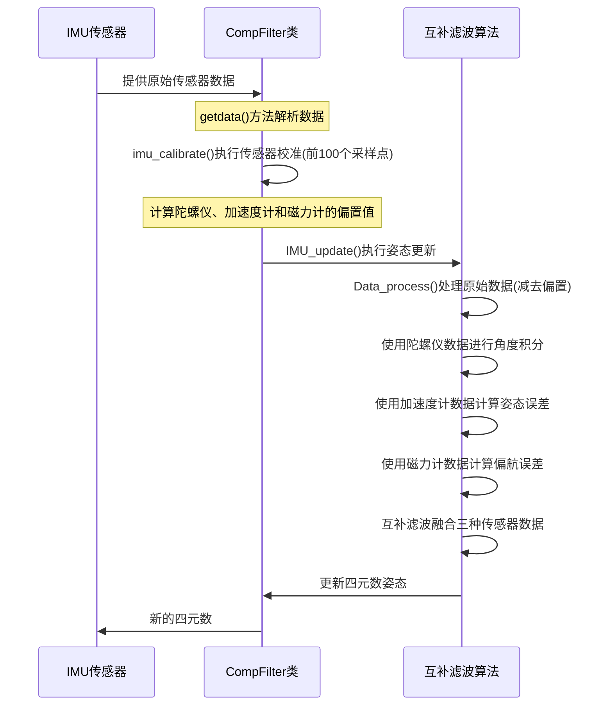

# CF
Complementary Filter in MATLAB based on IMU attitude estimation code from ANO TC
# IMU互补滤波器姿态估计算法

## 项目简介

本项目是一个基于MATLAB实现的IMU（惯性测量单元）姿态估计算法，采用互补滤波器（Complementary Filter）方法融合加速度计、陀螺仪和磁力计数据。

项目参考ANO飞控拓空者P2的解算方案。
>拓空者P2的源码没有开源，请支持正版

## 功能特性

- 基于互补滤波算法的姿态估计
- 支持加速度计、陀螺仪、磁力计数据融合
- 实现NED（北东地）坐标系下的姿态解算
- 包含传感器校准功能
- 提供可视化工具辅助调试和分析

## 文件说明

| 文件名 | 说明 |
|--------|------|
| CompFilter.m | 核心互补滤波器类，实现姿态估计算法 |
| attEstiamtion.m | 姿态估计示例程序 |
| generateNewData.m | 生成测试数据用于仿真 |
| Helper*.m | 各类辅助模块，用于绘图、滚动显示、姿态可视化等 |

## 算法原理

### 互补滤波器

互补滤波器是一种将高频信号和低频信号进行融合的算法。在IMU姿态估计中：

- 陀螺仪数据积分可以得到较准确的短期姿态变化，但存在漂移问题（低频噪声）
- 加速度计和磁力计可以提供长期稳定的参考，但对振动等高频噪声敏感

互补滤波器通过高通滤波器过滤陀螺仪数据，低通滤波器过滤加速度计/磁力计数据，然后将两者融合得到更准确的姿态估计。

### 坐标系说明

本项目使用NED（北东地）坐标系：

- X轴：指向北
- Y轴：指向东
- Z轴：指向地

姿态角定义：

- Roll（横滚角）：绕X轴旋转
- Pitch（俯仰角）：绕Y轴旋转
- Yaw（偏航角）：绕Z轴旋转

## 使用方法

### 运行示例程序

1. 运行 generateNewData.m 生成测试数据：

   ```matlab
   generateCircularTrajSensorData()
   ```

2. 运行 attEstiamtion.m 查看姿态估计结果：

   ```matlab
   attEstiamtion
   ```

## 参数调节

主要可调节参数在config结构体中：

- `kp_accel`: 加速度计比例系数，影响姿态校正强度
- `ki_accel`: 加速度计积分系数，影响长期稳定性
- `kp_mag`: 磁力计比例系数，影响航向校正强度
- `accelFs`: 传感器采样频率设置,默认采样频率和accelFs对齐

你还可以选择禁用传感器：

- 直接修改CompFiter:
```matlab
%1:使用 0:禁用
 USE_MAG=1;
 USE_ACC=1;
 USE_GYR=1;

```

### 核心类使用说明

创建互补滤波器对象：

```matlab
compFilt = CompFilter();
```

初始化配置：

```matlab
config = struct(...
    'filtercoef', struct(...   % 滤波系数
        'kp_accel', 0.1, ...  
        'ki_accel', 0.002, ...    
        'kp_mag', 0.015, ...
        'kp_gps', 0.8 ...
    ), ...
    'fs', struct(...           % 传感器频率
        'accelFs', 100, ...
        'gyroFs', 100, ...
        'magFs', 100, ...
        'gpsFs', 5 ...
    ) ...
);

compFilt.SensorInit(refloc, config);
```

处理传感器数据：

```matlab
% 准备传感器数据帧
sensordata = struct(...
        'imu', struct(...
            'accel', [x,y,z], ...
            'gyro', [x,y,z], ...
            'mag', [x,y,z] ...
        ),...
        'gps',struct(...
            'lla', [lat,lon,alt],...
            'gpsvel', [vx,vy,vz]...
        )...
);

% 更新数据并执行姿态估计
compFilt.getdata(sensordata);
compFilt.ImuUpdate();

% 获取估计的姿态（四元数形式）
estimatedOrient = compFilt.imu.q;
```

>注意：这个q代表的是从导航坐标系到机体坐标系的旋转

## 算法时序图



## 传感器校准

算法在开始运行的前100个采样点会进行传感器校准：
1. 计算加速度计、陀螺仪和磁力计的平均值
2. 确定各传感器的偏置值
3. 设置参考北向方向

校准期间设备需要保持静止，以确保获得准确的偏置值。

>注意第三条，该模型没有内置磁偏角校正，默认当地磁场北方


## 不足与挖坑

1. 磁力计计算方式太不优雅了，后续可能改成加入磁偏角了
2. 可以看到本代码有的properties压根没用到，这是方便后续开坑，勿怪罪
3. 互补滤波器的效果还是不太行，只能将结果收敛为2.5度，后续看看能不能出一个自适应的算法，或者直接卡尔曼滤波？
4. 接下来可能会加入gps，但是可能不如直接开新坑做一个轨迹跟踪


